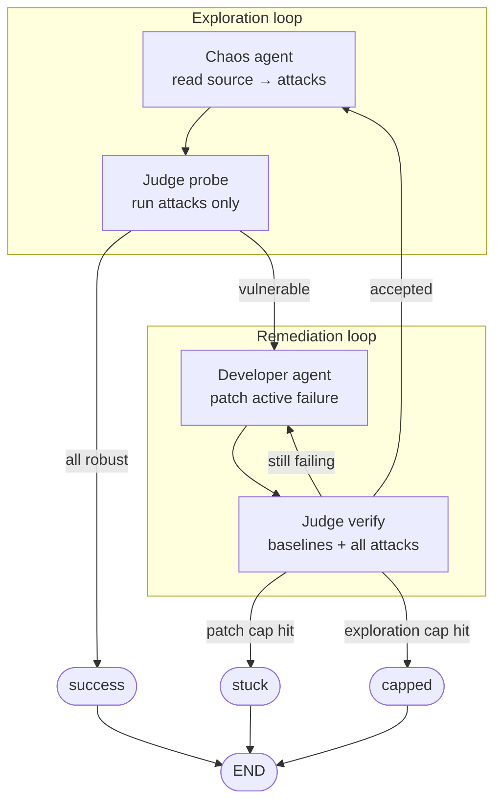

# Chaos QA Swarm

**Autonomous white-box QA for logic bugs** — LLM agents read your FastAPI source, craft compound attack payloads, patch failures, and prove fixes through a deterministic regression gate.

Most fuzzers mutate types within a schema. This project targets **branch logic**: conditions like `account_type == "legacy"` **and** `months_active == 0` that only crash together. A Chaos agent reads the code path, proposes the compound payload deliberately, and a Developer agent patches it — all orchestrated by a LangGraph loop with Docker-isolated verification.

---

## At a glance

| | Traditional schema fuzzer | Chaos QA Swarm |
| --- | --- | --- |
| **Input** | OpenAPI / JSON types | `target_app/` source code |
| **Strategy** | Random mutation | Hypothesis-first compound conditions |
| **Trap discovery** | Low for logic-only bugs | Targets unhandled branches (div-by-zero, KeyError, logic gaps) |
| **Remediation** | Manual | Developer agent + baseline regression gate |
| **Observability** | Request logs | Langfuse traces (node timing, token cost) |

**Example:** the loyalty endpoint requires `months_active=0` **and** `account_type=legacy` together. A schema fuzzer may hit `0` or `"legacy"` independently; white-box Chaos reads the branch and proposes both.

Trap ground truth for maintainers: [`docs/VULNERABILITIES.md`](docs/VULNERABILITIES.md) — intentionally **not** exposed to agents.

---

## Architecture



| Layer | Package | Role |
| --- | --- | --- |
| **Target app** | `target_app/` | FastAPI service with 5 endpoints and compound logical traps |
| **Judge** | `judge/` | Deterministic sandbox — runs payloads, classifies verdicts, no LLM |
| **Agents** | `agents/` | Groq + LangChain — Chaos (attacks) and Developer (patches) |
| **Graph** | `graph/` | LangGraph dual-loop orchestration and state machine |
| **Observability** | `observability/` | Optional Langfuse tracing per node and LLM call |

### Judge verdicts

| Verdict | Meaning |
| --- | --- |
| `robust` | Handled gracefully (200 with expected data, or 400/422 validation) |
| `vulnerable` | Crash, 500, or unhandled exception |
| `logic_error` | 200 but failed `response_checks` |
| `invalid_request` | Timeout, 404, or unreachable route |

Patches are applied as a `source_files` overlay — the Judge never mutates disk; it spins up an isolated copy with your candidate source.

---

## Quick start

```bash
git clone https://github.com/melbrbry/chaos-qa-swarm.git
cd chaos-qa-swarm
python -m venv .venv && source .venv/bin/activate
pip install -e ".[dev,full]"
cp .env.example .env   # add GROQ_API_KEY; optional LANGFUSE_* keys
```

Run the full autonomous loop:

```bash
python scripts/run_swarm.py
```

Linear demo (Chaos → Judge, optional single patch — no graph):

```bash
python scripts/run_chaos_probe.py
python scripts/run_chaos_probe.py --patch
```

Run the target app standalone:

```bash
uvicorn target_app.main:app --reload --port 8000
# GET http://localhost:8000/health
```

Both CLI scripts auto-load `.env` from the repo root.

---

## How the swarm works

### Exploration loop

1. **Chaos** reads merged patched source and emits 1–3 structured attack payloads (Groq strict JSON schema).
2. **Judge probe** executes only those attacks against accepted `source_files`.
3. If every attack is robust → **`success`**. Otherwise the first failure becomes `active_failure` and remediation begins.

### Remediation loop

1. **Developer** patches one failure at a time, merging into `candidate_source_files` (not promoted yet).
2. **Judge verify** runs **10 baseline happy-path requests + all attack requests** against the candidate overlay.
3. All robust → patch promoted, re-Chaos for new vectors (unless exploration cap hit → **`capped`**).
4. Still failing → retry with rejection context until patch cap → **`stuck`**.

Success means Chaos can no longer produce exploitable attacks on the accepted overlay — not merely that one patch worked.

---

## Tech stack

- **Python 3.10+**, **FastAPI** target app
- **LangChain + LangGraph** agent orchestration
- **Groq** LLM with strict JSON schema structured output
- **Docker** (default) or local subprocess for Judge sandbox isolation
- **Langfuse** (optional) for trace spans, token usage, and run metadata
- **pytest** with unit, integration, LLM, and Langfuse marker suites

---

## Project structure

```
chaos-qa-swarm/
├── target_app/          # FastAPI app with intentional logic traps
├── judge/               # Sandbox executor, baseline gate, verdict criteria
├── agents/              # Chaos & Developer agents, prompts, patch validation
├── graph/               # LangGraph nodes, routing, swarm state
├── observability/       # Langfuse tracing helpers
├── scripts/             # run_swarm.py, run_chaos_probe.py, export_schemas.py
├── tests/               # Unit + integration test suites
├── schemas/             # Machine-readable endpoint schemas
└── docs/                # API reference, vulnerability catalog (maintainers only)
```

---

## Configuration

| Variable | Default | Purpose |
| --- | --- | --- |
| `GROQ_API_KEY` | — | Required for agents |
| `CHAOS_QA_MODEL` | `openai/gpt-oss-120b` | Groq model ID |
| `CHAOS_REASONING_EFFORT` | `medium` | `low` / `medium` / `high` (falls back on schema failures) |
| `CHAOS_ATTACK_MAX` | `3` | Max attacks per Chaos run |
| `CHAOS_MAX_PATCH_ITERATIONS` | `3` | Inner remediation attempts per round |
| `CHAOS_MAX_EXPLORATION_ROUNDS` | `3` | Re-Chaos cycles after successful verifies |
| `JUDGE_SANDBOX` | `docker` | `docker` (isolated container) or `local` (dev subprocess) |
| `LANGFUSE_PUBLIC_KEY` | — | Optional tracing |
| `LANGFUSE_SECRET_KEY` | — | Optional tracing |
| `LANGFUSE_HOST` | `https://cloud.langfuse.com` | Langfuse Cloud base URL |
| `LANGFUSE_ENABLED` | auto | Set `0` to force disable |

For local development without Docker:

```bash
JUDGE_SANDBOX=local python scripts/run_swarm.py
```

---

## Observability

When Langfuse keys are set, `run_swarm.py` validates credentials before starting and attaches nested spans:

| Span | Contents |
| --- | --- |
| `chaos-qa-swarm-run` | Session id, final status, exploration/patch counts |
| `chaos` | Attack count, analysis notes, Groq token usage |
| `judge_probe` | Request/failure counts, active failure path |
| `developer` | Patch iteration, failure kind, rejection context |
| `judge_verify` | Baseline + attack counts, accepted flag |

Filter by tag **`chaos-qa-swarm`** in the Langfuse UI. Tracing is silently disabled when keys are missing or invalid — the swarm runs unchanged.

---

## Testing

```bash
# Unit tests (no API keys, no Docker)
pytest tests/ -m "not integration and not llm and not langfuse"

# Judge integration (pick one backend)
JUDGE_SANDBOX=local pytest tests/test_judge_integration.py -m integration
JUDGE_SANDBOX=docker pytest tests/test_judge_integration.py -m integration

# Full graph integration
JUDGE_SANDBOX=local pytest tests/test_graph_integration.py -m integration

# Live Groq / Langfuse (requires keys)
pytest tests/ -m llm
pytest tests/ -m langfuse
```

Baseline happy-path tests (must pass after any patch):

```bash
pytest tests/test_baseline_happy_path.py -v
```

---

## Programmatic usage

```python
from graph import build_graph, initial_state

final = build_graph().invoke(initial_state())
print(final["status"], final["message"])
```

```python
from agents.chaos_agent import generate_attacks, probe_attacks
from agents.developer_agent import generate_patch, merge_source_files
from judge.executor import evaluate_payloads
from judge.models import PayloadRequest

strategy = generate_attacks()
results = probe_attacks(strategy)

patch = generate_patch(
    source_files={},
    failed_request=results[0].request,
    stack_trace=results[0].stack_trace or "",
)
merged = merge_source_files({}, patch)
```

---

## Further reading

- [`docs/API_SCHEMA.md`](docs/API_SCHEMA.md) — human-readable API reference
- [`docs/VULNERABILITIES.md`](docs/VULNERABILITIES.md) — trap catalog (maintainers / evaluators)
- Regenerate JSON schemas after model changes: `python scripts/export_schemas.py`

---

## License

Portfolio / demonstration project. See repository for usage terms.
