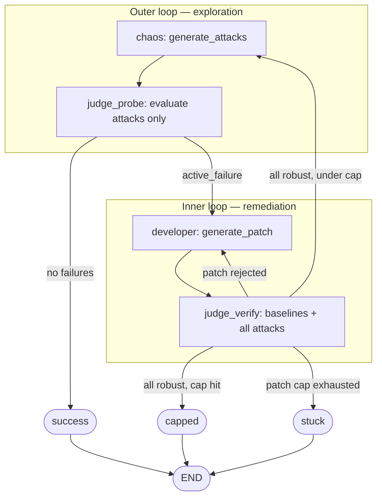
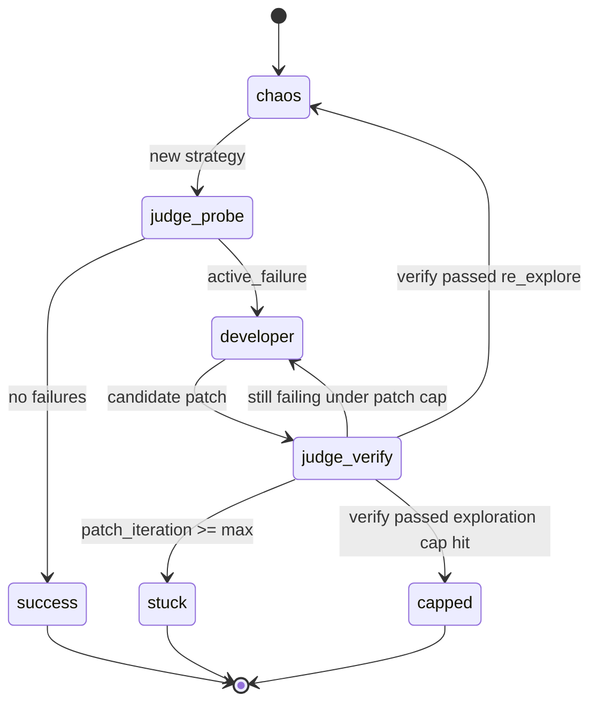

# Chaos QA Swarm

**White-Box Semantic Fuzzing** pipeline: a source-readable FastAPI target app, happy-path regression tests, a deterministic Judge sandbox, and LLM agents for attack generation and patching.

## White-Box vs Black-Box

| Approach | Input | How it finds bugs |
| --- | --- | --- |
| **Black-box fuzzing** | JSON Schema / OpenAPI | Mutates fields randomly against type constraints |
| **White-box (this project)** | `target_app/` source code | Reads logic branches, hypothesizes compound payloads that execute vulnerable paths |

Trap ground truth for maintainers lives in [`docs/VULNERABILITIES.md`](docs/VULNERABILITIES.md) — not in source comments or agent prompts.

## Setup

```bash
cd ~/Desktop/chaos-qa-swarm
python -m venv .venv
source .venv/bin/activate
pip install -e ".[dev,judge,agents]"
cp .env.example .env   # set GROQ_API_KEY for agents
```

Run the app locally:

```bash
uvicorn target_app.main:app --reload --port 8000
```

- Health: `GET http://localhost:8000/health`
- OpenAPI: `http://localhost:8000/openapi.json`

## Phase 1 — Target App

- FastAPI app with 5 endpoints containing compound logical traps
- Happy-path baseline tests that must pass after any future patch
- Machine-readable JSON schemas under `schemas/` (API reference and Judge routing)

```bash
pytest tests/test_baseline_happy_path.py -v
```

## Phase 2 — Judge (Deterministic Sandbox)

The Judge executes payloads against an isolated copy of `target_app/` and classifies outcomes without an LLM.

| Verdict | Meaning |
| --- | --- |
| `robust` | Handled gracefully (200 with expected data, or 400/422 validation) |
| `vulnerable` | Crash, 500, or unhandled exception |
| `logic_error` | 200 but failed `response_checks` |
| `invalid_request` | Timeout, 404, or unreachable route |

Backends:

- **Docker** (default): real container isolation via `JUDGE_SANDBOX=docker`
- **Local** (dev): subprocess uvicorn via `JUDGE_SANDBOX=local` — no container isolation

Usage:

```python
from judge.executor import evaluate_payloads
from judge.models import PayloadRequest

results = evaluate_payloads(
    source_files={},
    requests=[
        PayloadRequest(
            path="/api/loyalty/score",
            body={"account_type": "legacy", "months_active": 0, "base_points": 100},
        ),
        PayloadRequest(
            path="/api/report/aggregate",
            body={"groups": [[], [7, 8]], "metric": "throughput"},
            response_checks={"first_value": 7},
        ),
    ],
)
for result in results:
    print(result.verdict, result.stack_trace)
```

Run Judge tests:

```bash
pytest tests/test_judge_criteria.py tests/test_source_overlay.py -v
JUDGE_SANDBOX=local pytest tests/test_judge_integration.py -v -m integration
JUDGE_SANDBOX=docker pytest tests/test_judge_integration.py -v -m integration
```

Patches are applied via `source_files: dict[str, str]` overlay (see `judge/source_overlay.py`).

## Phase 3 — White-Box Agents

LangChain + Groq agents read `target_app/` source (not `VULNERABILITIES.md`) and produce structured outputs validated with Groq **strict JSON schema** mode (`method="json_schema"`, `strict=True`).

| Agent | API | Output |
| --- | --- | --- |
| **Chaos** | `generate_attacks()` → `probe_attacks()` | 1–3 attacks per run (no padding) |
| **Developer** | `generate_patch(source_files, failed_request, stack_trace)` | `patched_files` overlay map |

Reasoning depth is set via the Groq API parameter `reasoning_effort` (default `high`), not in system prompts.

### Environment variables

| Variable | Default | Purpose |
| --- | --- | --- |
| `GROQ_API_KEY` | — | Groq API authentication (required for agents) |
| `CHAOS_QA_MODEL` | `openai/gpt-oss-120b` | Groq model ID |
| `CHAOS_REASONING_EFFORT` | `high` | Groq reasoning effort (`low` / `medium` / `high`) |
| `CHAOS_ATTACK_MAX` | `3` | Max attacks per chaos run |
| `JUDGE_SANDBOX` | `docker` | `local` or `docker` for probe / Judge runs |

### Programmatic usage

```python
from agents.chaos_agent import generate_attacks, probe_attacks
from agents.developer_agent import generate_patch, merge_source_files

strategy = generate_attacks()
results = probe_attacks(strategy)

# After a vulnerable result:
patch = generate_patch(
    source_files={},
    failed_request=results[0].request,
    stack_trace=results[0].stack_trace or "",
)
merged = merge_source_files({}, patch)
```

### Manual probe script

Chaos → Judge, with optional single-patch re-eval:

```bash
export GROQ_API_KEY=...
JUDGE_SANDBOX=local python scripts/run_chaos_probe.py
JUDGE_SANDBOX=local python scripts/run_chaos_probe.py --patch
```

With `--patch`, the script patches the **first** `vulnerable` / `logic_error` result and re-runs **only that attack payload** against the patched overlay. Use `scripts/run_swarm.py` for the full LangGraph loop with baseline regression gating.

### Tests

Unit tests (no API key):

```bash
pytest tests/test_agents_models.py tests/test_agents_converters.py tests/test_source_bundle.py \
  tests/test_developer_validation.py tests/test_llm.py tests/test_chaos_agent.py \
  tests/test_developer_agent.py -v
```

Optional live Groq test:

```bash
pytest tests/test_agents_live.py -v -m llm
```

## Phase 4 — LangGraph Swarm Loop

Autonomous **exploration + remediation** wired in [`graph/`](graph/) with LangGraph. Phase 3 agents and the Judge are unchanged; the graph orchestrates when they run and what state passes between nodes.

### Full architecture





| Component | Package | Role |
| --- | --- | --- |
| **Chaos** | `agents/chaos_agent.py` | `generate_attacks(source_files=…)` — reads merged patched source on re-explore |
| **Developer** | `agents/developer_agent.py` | `generate_patch(…, rejection_context=…)` — one failure per call; retry feedback after verify |
| **Judge probe** | `graph/nodes.py` | Runs **attack requests only** against accepted `source_files` |
| **Judge verify** | `graph/nodes.py` | Runs **baseline requests + all attack requests** against **candidate** overlay |
| **Baseline gate** | `judge/baseline.py` | 10 happy-path `PayloadRequest`s with `response_checks` |
| **Graph** | `graph/graph.py` | `build_graph()` — dual-loop routing |

### Dual loops

| Loop | Nodes | Purpose |
| --- | --- | --- |
| **Outer (exploration)** | `chaos` → `judge_probe` | Re-read patched source; discover new attack vectors |
| **Inner (remediation)** | `developer` → `judge_verify` | Fix one `active_failure` per developer call; prove patch via full verify |

Re-Chaos runs after **verify accepts** a patch (all baselines + attacks robust), unless `CHAOS_MAX_EXPLORATION_ROUNDS` is reached.

### How failures are handled

**Probe** (`judge_probe`) — entry into remediation:

- Evaluates only the current chaos `attack_requests`.
- Sets **one** `active_failure`: the first `vulnerable` / `logic_error` result.
- Routes to `developer` or ends with `success` if none fail.

**Verify** (`judge_verify`) — gate before accepting a patch:

- Evaluates `baseline_requests() + attack_requests` in one Judge session.
- A patch is **promoted** to `source_files` only when **every** row is robust.
- If anything fails, **one primary failure** drives the next developer call (priority: baseline regression → attack → startup). Other failures are listed in `PatchRejectionContext.other_failures`.
- A **second** attack that failed on probe but was not `active_failure` can surface here in the **same inner loop** after the first patch — verify re-runs all attacks without waiting for re-Chaos.

**Developer** — one target per invocation:

- Input: `active_failure` (`failed_request` + stack trace) and optional `PatchRejectionContext` on retries.
- Output: candidate overlay merged into `candidate_source_files` (not promoted until verify passes).

### Terminal status

| Status | When |
| --- | --- |
| `success` | `judge_probe` finds no exploitable attacks (Chaos attacks all robust on current source) |
| `stuck` | Inner loop hits `CHAOS_MAX_PATCH_ITERATIONS` without verify passing |
| `capped` | Verify passed but `CHAOS_MAX_EXPLORATION_ROUNDS` reached (no further re-Chaos) |

Success means Chaos can no longer produce exploitable attacks on the accepted overlay — not merely that one patch worked.

### Environment variables

| Variable | Default | Purpose |
| --- | --- | --- |
| `CHAOS_MAX_PATCH_ITERATIONS` | `3` | Inner remediation attempts per exploration round |
| `CHAOS_MAX_EXPLORATION_ROUNDS` | `3` | Re-Chaos cycles after successful verifies |

(Plus Phase 3 vars: `GROQ_API_KEY`, `CHAOS_QA_MODEL`, `CHAOS_REASONING_EFFORT`, `CHAOS_ATTACK_MAX`, `JUDGE_SANDBOX`.)

### Run the swarm

```bash
export GROQ_API_KEY=...
JUDGE_SANDBOX=local python scripts/run_swarm.py
```

Programmatic:

```python
from graph import build_graph, initial_state

final_state = build_graph().invoke(initial_state())
print(final_state["status"], final_state["message"])
```

Phase 3 linear demo (no graph, no baseline gate): `python scripts/run_chaos_probe.py`

### Tests

```bash
pytest tests/test_graph_routing.py tests/test_graph_nodes.py tests/test_baseline_requests.py -v
JUDGE_SANDBOX=local pytest tests/test_graph_integration.py -v -m integration
```

## API reference

Human-readable docs: [`docs/API_SCHEMA.md`](docs/API_SCHEMA.md)

Regenerate `schemas/` after changing Pydantic models:

```bash
python scripts/export_schemas.py
```
